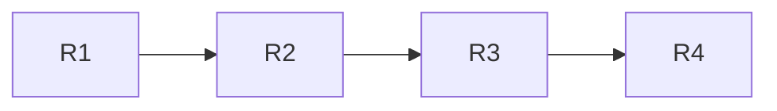
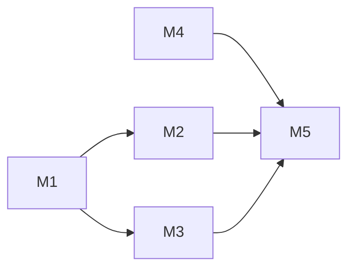

# KeepLiveService - 开发计划

> **版本**: v2.0.1
> **创建日期**: 2026年2月20日
> **文档状态**: 阶段二 - 实现阶段（README 默认中文 + 全项目文档整理）

---

## 2026-05-28 阶段二：Rust 重构第一阶段

### 需求概述

在当前 C++ JNI 能力保持不变的前提下，新增 Rust Native 构建骨架，为后续迁移 JNI 外层、字符串保护、MediaRoute、进程/Socket 与 startActivity 编排做工程准备。

### 复杂度评估

级别：🟡 Standard
依赖模式：Linear

### 三轮拆解记录

| 轮次 | 拆解层级 | 结果 |
|------|----------|------|
| 第 1 轮 | 迁移边界 | 本阶段只接 Rust so 骨架，不替换 `fw_native` / `fw_mediaroute` 行为 |
| 第 2 轮 | 构建链路 | Gradle 增加 `-PfwBuildRust=true` 可选开关，生成 4 ABI `libfw_rust.so` |
| 第 3 轮 | 验收顺序 | 先验证默认 Android 构建不受影响，再验证 Rust 工具链和可选 so 打包 |

### 模块拆解

| ID | 模块 | 描述 | 改动文件 | 依赖 | 状态 |
|----|------|------|---------|------|------|
| R1 | Rust crate 骨架 | 新增 `fw_rust` cdylib、JNI 动态注册、能力探测函数 | `framework/src/main/rust/fw_rust/*` | 无 | ✅ |
| R2 | Gradle 构建接入 | 增加 4 ABI Rust 构建、复制到 generated jniLibs、默认关闭构建开关 | `framework/build.gradle.kts`, `.gitignore` | R1 | ✅ |
| R3 | Kotlin 内部桥 | 新增内部 `FwRustNative`，仅探测可选 so，不接主链路 | `framework/src/main/java/com/service/framework/rust/FwRustNative.kt` | R1-R2 | ✅ |
| R4 | 文档与测试 | README、开发计划、自动化测试计划记录 Rust 构建方式 | `README*`, `开发计划.md`, `自动化测试计划.md` | R1-R3 | ✅ |

### DAG 依赖图



### 执行记录

| 波次 | Agent | 模块 | 结果 | 备注 |
|------|-------|------|------|------|
| 1 | Codex | R1-R3 | 完成 | 新增 Rust crate、Gradle 任务、Kotlin 内部桥 |
| 2 | Codex | R4 | 完成 | README 多语言入口、开发计划、自动化测试计划、CHANGELOG 已同步 |
| QA | Codex | 全部 | 通过 | 默认构建与可选 Rust Release 构建均通过 |

### 变更审计日志

| 时间 | 操作 | 变更内容 | 操作者 |
|------|------|---------|--------|
| 2026-05-28 18:08:19 CST | 创建计划 | 新增 Rust 重构第一阶段计划 | Codex |
| 2026-05-28 18:27:45 CST | 代码实现 | 新增 `fw_rust`、`FwRustNative`、Gradle Rust 4 ABI 构建任务 | Codex |
| 2026-05-28 18:27:45 CST | 构建验证 | `./gradlew clean build` 与 `./gradlew :framework:assembleRelease -PfwBuildRust=true -PfwCargoPath=/opt/homebrew/opt/rustup/bin/cargo` 通过 | Codex |
| 2026-05-28 18:27:45 CST | 产物审计 | AAR 包含 4 ABI `libfw_rust.so`，动态导出仅 `JNI_OnLoad`，LOAD Align 为 `0x4000` | Codex |

### 当前进度

总进度：4/4 (100%)

---

## 2026-05-28 阶段二：Rust 进程信息迁移

### 需求概述

在 Rust Native 骨架稳定后，先迁移低风险只读系统信息能力，包括 OOM adj、系统内存、进程状态、root 痕迹和进程数量，为后续迁移 JNI 外层积累可验证闭环。

### 复杂度评估

级别：🟡 Standard
依赖模式：Linear

### 三轮拆解记录

| 轮次 | 拆解层级 | 结果 |
|------|----------|------|
| 第 1 轮 | 风险边界 | 只迁移只读 `/proc` 能力，不触碰 Binder、Parcel、fork、Socket、startActivity |
| 第 2 轮 | 接口边界 | Rust 动态注册新增进程探测方法，Kotlin 通过内部桥读取快照 |
| 第 3 轮 | 接入方式 | `FwNative` 摘要函数与健康巡检优先读取 Rust 快照，不存在 Rust so 时自动回退 |

### 模块拆解

| ID | 模块 | 描述 | 改动文件 | 依赖 | 状态 |
|----|------|------|---------|------|------|
| P1 | Rust 只读进程探测 | 新增 OOM、内存、进程状态、root、进程数量 JNI 方法 | `framework/src/main/rust/fw_rust/src/lib.rs` | Rust 骨架 | ✅ |
| P2 | Kotlin 快照桥 | 新增 `FwRustProcessSnapshot` 与安全读取封装 | `FwRustNative.kt` | P1 | ✅ |
| P3 | 健康巡检接入 | Native 巡检日志融合 Rust 快照，缺失 Rust so 时回退 | `FwHealthMonitor.kt`, `FwNative.kt` | P2 | ✅ |

### 执行记录

| 波次 | Agent | 模块 | 结果 | 备注 |
|------|-------|------|------|------|
| 1 | Codex | P1-P3 | 完成 | 受工具限制，本轮不派生子 Agent，主流程本地执行 |

### 变更审计日志

| 时间 | 操作 | 变更内容 | 操作者 |
|------|------|---------|--------|
| 2026-05-28 18:36:38 CST | 迁移实现 | Rust 新增只读进程探测，Kotlin 健康巡检接入快照回退链路 | Codex |

### 当前进度

总进度：3/3 (100%)

---

## 2026-05-28 阶段二：Rust MediaRoute 迁移与模拟器测试

### 需求概述

继续迁移适合 Rust 替代的 JNI 层能力，将 MediaRoute native 服务状态、WakeLock 检查计数和心跳判断迁移到 Rust，并在完成后启动 Android 模拟器进行安装与基础运行验证。

### 复杂度评估

级别：🟡 Standard
依赖模式：Linear

### 三轮拆解记录

| 轮次 | 拆解层级 | 结果 |
|------|----------|------|
| 第 1 轮 | 迁移范围 | 只迁移 MediaRoute 状态机和心跳，不迁移 Android WakeLock 获取本身 |
| 第 2 轮 | 回退策略 | Kotlin `FwMediaRouteNative` 优先 Rust，Rust 不可用时回退 C++ `fw_mediaroute` |
| 第 3 轮 | 验收路径 | 本地构建、Rust so 符号/对齐审计、模拟器安装与基础启动验证 |

### 模块拆解

| ID | 模块 | 描述 | 改动文件 | 依赖 | 状态 |
|----|------|------|---------|------|------|
| M1 | Rust MediaRoute 状态机 | 新增 Rust 全局状态、服务启停、心跳与状态码 JNI 方法 | `framework/src/main/rust/fw_rust/src/lib.rs` | Rust 骨架 | ✅ |
| M2 | Kotlin 回退接入 | 新增 `FwRustMediaRouteNative`，`FwMediaRouteNative` 改为 Rust 优先/C++ 回退 | `FwRustMediaRouteNative.kt`, `FwMediaRouteNative.kt` | M1 | ✅ |
| M3 | 模拟器验收 | 构建后启动模拟器，安装 App，执行基础运行与日志验证 | Gradle/ADB/Emulator | M1-M2 | ✅ |

### 执行记录

| 波次 | Agent | 模块 | 结果 | 备注 |
|------|-------|------|------|------|
| 1 | Codex | M1-M2 | 完成 | Rust MediaRoute 状态机与 Kotlin 回退链路已完成 |
| 2 | Codex | M3 | 完成 | Android 16 模拟器安装、启动、日志与 connectedAndroidTest 已验证 |

### 变更审计日志

| 时间 | 操作 | 变更内容 | 操作者 |
|------|------|---------|--------|
| 2026-05-28 18:45:29 CST | 迁移实现 | 新增 Rust MediaRoute 状态机与 Kotlin Rust 优先回退入口 | Codex |
| 2026-05-28 18:54:45 CST | 本地验证 | `cargo fmt --check`、`git diff --check`、`./gradlew :framework:lintRelease`、`./gradlew clean build`、`./gradlew :framework:assembleAndroidTest :app:assembleAndroidTest` 均通过 | Codex |
| 2026-05-28 18:54:45 CST | Native 审计 | Rust AAR 产物包含 4 ABI `libfw_rust.so`，动态导出仅 `JNI_OnLoad`，LOAD Align 均为 `0x4000` | Codex |
| 2026-05-28 18:59:52 CST | 模拟器验证 | `medium_phone` Android 16 / arm64-v8a 启动成功，带 Rust debug APK 安装成功，`SplashActivity` 可启动，Rust MediaRoute 初始化日志正常 | Codex |
| 2026-05-28 19:00:45 CST | 设备侧测试 | 首轮 `connectedAndroidTest` 验证了安装和基础链路；后续已补齐真实 instrumentation 用例并在 Android 16 模拟器复验通过 | Codex |

### 当前进度

总进度：3/3 (100%)

---

## 2026-05-28 阶段二：Rust Native 真实设备测试与打包边界收尾

### 需求概述

对 Rust JNI 第一阶段做发布前收尾：补齐真实设备侧 instrumentation 测试，验证默认 C++ 回退与可选 Rust 打包两套矩阵，并修复默认构建误打包历史 `libfw_rust.so` 的边界问题。

### 复杂度评估

级别：🟡 Standard
依赖模式：Fan-in

### 三轮拆解记录

| 轮次 | 拆解层级 | 结果 |
|------|----------|------|
| 第 1 轮 | 测试入口 | framework 覆盖 Rust 进程快照、Rust MediaRoute 状态机、公共 MediaRoute 后端迁移；app 覆盖 Native startActivity 策略 |
| 第 2 轮 | 构建矩阵 | 默认构建必须只打包 C++ so；显式 `-PfwBuildRust=true` 才打包 4 ABI `libfw_rust.so` |
| 第 3 轮 | 设备验证 | Android 16 / arm64-v8a 模拟器分别执行默认 C++ 回退和 Rust 打包 `connectedAndroidTest` |

### 模块拆解

| ID | 模块 | 描述 | 改动文件 | 依赖 | 状态 |
|----|------|------|---------|------|------|
| T1 | Rust instrumentation | 新增 Rust 进程探测、MediaRoute 状态机、公共入口后端迁移测试 | `framework/src/androidTest/java/com/service/framework/rust/FwRustNativeInstrumentedTest.kt` | Rust Native | ✅ |
| T2 | startActivity instrumentation | 新增 C++ `start/` 真实触发测试，覆盖稳定策略、受限策略和枚举完整性 | `app/src/androidTest/java/com/google/services/FwStartInstrumentedTest.kt` | C++ start | ✅ |
| T3 | Debug 测试 Activity | 新增 debug-only 极简 Activity，避免 Compose 动画影响 instrumentation idle | `app/src/debug/*` | T2 | ✅ |
| T4 | 打包边界修复 | `jniLibs` 生成目录只在 `fwBuildRust=true` 时加入 variant source | `framework/build.gradle.kts` | Rust Gradle | ✅ |
| T5 | 文档记录 | 同步开发计划与自动化测试计划，记录两套矩阵结果 | `开发计划.md`, `自动化测试计划.md` | T1-T4 | ✅ |

### 验证记录

| 验证项 | 命令/方式 | 结果 |
|--------|-----------|------|
| Rust 格式 | `PATH=/opt/homebrew/opt/rustup/bin:$PATH cargo fmt --check` | ✅ |
| 默认完整构建 | `./gradlew clean build` | ✅ |
| AndroidTest 构建 | `./gradlew :framework:assembleAndroidTest :app:assembleAndroidTest -PfwBuildRust=true -PfwCargoPath=/opt/homebrew/opt/rustup/bin/cargo` | ✅ |
| Rust 构建矩阵 | `./gradlew :framework:assembleRelease :app:assembleDebug -PfwBuildRust=true -PfwCargoPath=/opt/homebrew/opt/rustup/bin/cargo` | ✅ |
| 默认构建矩阵 | `./gradlew :framework:assembleRelease :app:assembleDebug --rerun-tasks` | ✅ |
| 默认产物审计 | 检查 APK/AAR 中 `libfw_rust.so` | ✅ 未误打包 |
| Rust 产物审计 | 检查 APK/AAR 中 `libfw_rust.so` | ✅ 4 ABI 均存在 |
| 默认 C++ 回退测试 | `./gradlew :app:connectedAndroidTest --rerun-tasks` 与 `./gradlew :framework:connectedAndroidTest --rerun-tasks` | ✅ |
| Rust 打包测试 | `./gradlew connectedAndroidTest --rerun-tasks -PfwBuildRust=true -PfwCargoPath=/opt/homebrew/opt/rustup/bin/cargo` | ✅ app 5 tests / framework 3 tests 全通过 |
| 崩溃日志扫描 | `adb -s emulator-5554 logcat -d` 关键错误扫描 | ✅ 无 AndroidRuntime/JNI/native crash |

### 当前进度

总进度：5/5 (100%)

---

## 2026-05-28 阶段二：全量保活策略优化升级

### 需求概述

对阶段一审计出的全部可吸收能力做工程化升级：统一健康巡检、策略状态管理、VPN 授权与前台化、Android 14/15/16 版本矩阵、体外 Activity 启动策略增强、文档和测试计划同步更新。

### 复杂度评估

级别：🔴 Enterprise
依赖模式：混合 Fan-out + Fan-in

### 三轮拆解记录

| 轮次 | 拆解层级 | 结果 |
|------|----------|------|
| 第 1 轮 | 风险分级 | P0 修复健康巡检、VPN、FGS 类型、默认侵入策略；P1 补齐配置链路、厂商/权限诊断、startActivity 策略；P2 默认关闭研究策略 |
| 第 2 轮 | 模块边界 | 拆成健康状态层、系统策略层、Native start 层、文档验证层 |
| 第 3 轮 | 交付顺序 | 先补状态模型和巡检，再修 VPN/FGS，再扩展 C++ 策略，最后更新 README/CHANGELOG/测试计划 |

### 模块拆解

| ID | 模块 | 描述 | 改动文件 | 依赖 | 状态 |
|----|------|------|---------|------|------|
| M1 | 健康巡检与策略状态 | 新增策略运行态、健康报告、`Fw.check()` 自动补偿 | `framework/src/main/java/com/service/framework/health/*`, `Fw.kt`, Job/Work/Alarm/Sync 辅助方法 | 无 | ✅ |
| M2 | VPN 与前台服务矩阵 | 补齐 VPN 授权、前台通知、非全局路由、FGS 类型动态选择 | `FwVpnService.kt`, `FwForegroundService.kt`, `AndroidManifest.xml` | M1 | ✅ |
| M3 | 配置链路补齐 | Companion、MediaBrowser、系统组件状态接入主链路 | `FwConfig.kt`, `Fw.kt`, `FwMediaBrowserService.kt`, `AndroidManifest.xml` | M1 | ✅ |
| M4 | C++ startActivity 扩展 | 增加 `NEW_TASK+EXCLUDE_RECENTS+NO_ANIMATION`、`moveTaskToFront`，完善 BAL 版本判断 | `framework/src/main/cpp/start/*`, `FwStartStrategy.kt`, `FwStartResult.kt` | 无 | ✅ |
| M5 | 文档与验证 | README/CHANGELOG/测试计划同步，保留中文默认入口 | `README.md`, `README-en.md`, `CHANGELOG.md`, `自动化测试计划.md` | M1-M4 | ✅ |

### DAG 依赖图



### 执行记录

| 波次 | Agent | 模块 | 结果 | 备注 |
|------|-------|------|------|------|
| 1 | Nash | 文档建议 | 完成 | README、CHANGELOG、测试计划需同步 |
| 1 | Kierkegaard | Native 建议 | 完成 | PendingIntent BAL、Binder、VirtualDisplay、默认策略边界已吸收 |
| 2 | Codex | 集成实现 | 完成 | 健康巡检、VPN、MediaBrowser、Native startActivity、文档已更新 |

### 变更审计日志

| 时间 | 操作 | 变更内容 | 操作者 |
|------|------|---------|--------|
| 2026-05-28 | 创建计划 | 新增全量优化升级计划 | Codex |
| 2026-05-28 | 代码升级 | 新增健康巡检、策略状态、MediaBrowser、VPN 授权前置、FGS 类型矩阵、startActivity 默认/审计双入口 | Codex |
| 2026-05-28 | 文档升级 | 更新中英文 README、CHANGELOG、llms 说明和自动化测试计划 | Codex |
| 2026-05-28 | 构建验证 | `./gradlew :framework:assembleDebug` 通过 | Codex |
| 2026-05-28 | 示例验证 | `./gradlew :app:assembleDebug` 通过；app 模块锁定 NDK 27.2 后已消除 NDK 28 空目录 strip 警告 | Codex |
| 2026-05-28 | 发布前验证 | `./gradlew :framework:assembleRelease` 通过，存在历史 Kotlin deprecation/Elvis 警告 | Codex |
| 2026-05-28 | QA 返修 | 1 像素 Activity、联系人/短信观察默认改为关闭；联系人/短信权限不再由库默认合并 | Codex |
| 2026-05-28 | 返修复验 | `git diff --check`、关键词残留扫描、三条 Gradle 构建均通过 | Codex |

### 外部资料核对记录

| 来源 | 吸收结论 | 落地位置 |
|------|----------|----------|
| Android 官方后台 Activity 启动限制 | Android 14-16 PendingIntent 后台启动必须按发送方/创建方模式适配 | `fw_start_jni_cache.cpp`, `fw_start_pending_intent.cpp`, README |
| Android 官方前台服务类型要求 | `specialUse` 需要说明子类型，前台服务类型按策略组合声明 | `AndroidManifest.xml`, `FwForegroundService.kt` |
| Android 官方 VPN 文档 | VPN 必须用户授权，服务声明 `BIND_VPN_SERVICE`，占位 VPN 不应默认路由真实流量 | `FwVpnService.kt`, `AndroidManifest.xml`, README |
| MarsDaemon / Leoric / Cactus / GitHub 保活项目 | 已覆盖双进程、Native、Job、Alarm、前台服务、强停竞争等主流开源策略；新增价值集中在健康巡检、MediaBrowser、VPN 授权化、Android 14-16 startActivity 适配 | framework 策略层与 C++ start 模块 |
| `/Users/qihao/逆向` 放大镜与 kuaichongleida 源码 | 已吸收 Activity 直启、NEW_TASK、PendingIntent、双 Intent、Binder、startActivityForResult、VirtualDisplay、NEW_TASK+EXCLUDE_RECENTS、moveTaskToFront | `framework/src/main/cpp/start/*`, `FwStartStrategy.kt` |

### 当前进度

总进度：5/5 (100%)

---

## 2026-05-26 阶段二：README 默认中文与文档整理

### 需求理解

将项目默认 GitHub README 调整为简体中文，同时保留英文文档入口；把统一体外 Activity / startActivity 策略纳入 README、辅助说明文件、引用元数据和 Maven POM，保证使用者能快速看到接入步骤，并在文档末尾看到完整能力边界。

### 三轮拆解记录

| 轮次 | 拆解层级 | 结果 |
|------|----------|------|
| 第 1 轮 | 语言入口 | `README.md` 承载默认中文，`README-en.md` 承载英文，`README-zh.md` 保留旧链接兼容 |
| 第 2 轮 | 能力覆盖 | README 中加入中英文能力覆盖、体外 Activity / startActivity 说明 |
| 第 3 轮 | 元数据覆盖 | 新增辅助说明文件，扩充 `CITATION.cff` 和 Maven POM 描述 |

### 修改文件清单

| 文件 | 操作 | 说明 |
|------|------|------|
| `README.md` | 重写 | 默认展示完整简体中文 README，并把使用步骤放在前面 |
| `README-en.md` | 新增 | 保留完整英文 README，并同步使用步骤与能力说明 |
| `README-zh.md` | 精简 | 旧链接兼容入口，指向默认中文与英文文档 |
| 辅助说明文件 | 新增/修改 | 增加统一体外 Activity 策略、语言入口、NDK 版本 |
| `CITATION.cff` | 修改 | 增加 startActivity、VirtualDisplay、PendingIntent BAL 描述 |
| `framework/build.gradle.kts` | 修改 | Maven POM 描述加入统一体外 Activity / startActivity 策略 |
| `CHANGELOG.md` | 修改 | 记录 README 语言切换与文档整理 |

### 验收项

| 验收项 | 验证方式 | 状态 |
|--------|----------|------|
| 默认 README 是简体中文 | 查看 `README.md` 标题与语言入口 | ✅ |
| 英文 README 可选择 | 查看 `README-en.md` 与 README 语言链接 | ✅ |
| 旧中文链接不失效 | 查看 `README-zh.md` 兼容入口 | ✅ |
| 体外 Activity 说明完整 | 搜索 `体外 Activity` / `unified startActivity` | ✅ |
| 辅助说明覆盖 | 查看辅助说明文件 | ✅ |
| 元数据覆盖 | 查看 `CITATION.cff` / `framework/build.gradle.kts` | ✅ |
| 版本号升级 | 查看 `gradle.properties` / `app/build.gradle.kts` / `framework/build.gradle.kts` / 使用文档 | ✅ |

---

## 2026-05-26 阶段二：统一 startActivity 策略实现

### 需求理解

在 `/Users/qihao/AndroidStudioProjects/KeepLiveService` 中新增 C++ `start/` 文件夹，对外暴露统一 `start` 函数，融合微信收藏 830-835、放大镜 qumeng 逆向、虚拟屏 so 逆向得到的 startActivity 方法，并同步 README 文档。

### 三轮拆解记录

| 轮次 | 拆解层级 | 结果 |
|------|----------|------|
| 第 1 轮 | 能力来源 | 微信收藏 830-835、放大镜 qumeng、虚拟屏 so 三类来源全部进入策略表 |
| 第 2 轮 | 工程模块 | C++ `start/` 目录、`FwNative` JNI、Kotlin `FwStart` 对外入口、README 文档 |
| 第 3 轮 | 策略执行 | 可安全执行的公开 API 真实调用；依赖漏洞/特权/系统 UI 的路径保留版本判断和跳过日志 |

### 修改文件清单

| 文件 | 操作 | 说明 |
|------|------|------|
| `framework/src/main/cpp/start/*.h/cpp` | 新增 | C++ start 策略编排、JNI 桥接、Context/PendingIntent/Binder/虚拟屏/系统 UI/shell 策略 |
| `framework/src/main/cpp/CMakeLists.txt` | 修改 | 增加 `start/` include 和源文件列表 |
| `framework/src/main/java/com/service/framework/native/FwNative.kt` | 修改 | 增加 `nativeStartActivity` 和对外 `start` 包装 |
| `framework/src/main/java/com/service/framework/start/FwStart.kt` | 新增 | Kotlin 对外 `FwStart.start(context, intent)` |
| `framework/src/main/java/com/service/framework/start/FwStartStrategy.kt` | 新增 | 13 个策略枚举和 modeMask 转换 |
| `framework/src/main/java/com/service/framework/start/FwStartResult.kt` | 新增 | Native 返回码结果模型 |
| `framework/build.gradle.kts` | 修改 | 指定本机已安装 NDK 27.2.12479018，避免失败安装的 NDK 28 空壳阻断构建 |
| `README.md` | 修改 | 增加统一 startActivity Strategy |
| `README-en.md` | 新增 | 增加 Unified startActivity Strategy |
| `README-zh.md` | 修改 | 兼容旧中文 README 链接 |

### 策略覆盖清单

| ID | 策略 | 来源 | 状态 |
|----|------|------|------|
| 1 | Activity Context 直启 | 放大镜 qumeng | ✅ 已实现 |
| 2 | Context + `FLAG_ACTIVITY_NEW_TASK` | 放大镜 qumeng | ✅ 已实现 |
| 3 | `PendingIntent.getActivity(...).send()` | 放大镜 qumeng / BAL 适配 | ✅ 已实现 |
| 4 | 双 Intent `startActivities` | 放大镜 qumeng | ✅ 已实现 |
| 5 | Binder `startActivities` | 放大镜 qumeng `ad.java` | ✅ 已实现 Android 21-30 分支 |
| 6 | `startActivityForResult` | 放大镜 qumeng `b.java` | ✅ 已实现公开 API 路径 |
| 7 | `VirtualDisplay + Presentation` | so 逆向 QFR/XNK | ✅ 已实现 launchDisplayId 路径 |
| 8 | Notification BAL token | 微信收藏 831 | ✅ 策略登记 + 安全跳过 |
| 9 | MediaButton BAL 传播 | 微信收藏 835 | ✅ 策略登记 + 安全跳过 |
| 10 | `startNextMatchingActivity` | 微信收藏 832 | ✅ 已实现公开 API 路径 |
| 11 | CredentialManager UI | 微信收藏 833 | ✅ 策略登记 + 安全跳过 |
| 12 | PrintManager UI PendingIntent | 微信收藏 834 | ✅ 策略登记 + 安全跳过 |
| 13 | `am start-in-vsync` | 微信收藏 830 | ✅ 策略登记 + 权限判断 + 安全跳过 |

### 验收项

| 验收项 | 验证方式 | 状态 |
|--------|----------|------|
| C++ `start/` 文件夹存在并暴露 `start` 函数 | 查看 `fw_start_api.h/cpp` | ✅ |
| Kotlin 有对外 `FwStart.start(context, intent)` | 查看 `FwStart.kt` | ✅ |
| 13 个策略不遗漏 | 查看 `FwStartStrategy.kt` 和 README 表格 | ✅ |
| CMake 接入所有新增 cpp | 查看 `CMakeLists.txt` | ✅ |
| README 英文/中文同步 | 查看 `README.md` / `README-en.md` | ✅ |
| NDK 版本锁定 | 查看 `framework/build.gradle.kts` | ✅ |
| 编译验证 | `./gradlew :framework:assembleDebug` | ✅ |

---

## 技术架构设计方案

### 1. 整体架构思想

采用**双模块分层解耦**架构，保活策略与示例应用分离，framework 模块可独立输出 AAR：

```
┌─────────────────────────────────────────────────────────────┐
│                    app 模块（示例应用）                        │
│        Jetpack Compose UI + Lottie + Material3               │
├─────────────────────────────────────────────────────────────┤
│                  framework 模块（核心保活库）                   │
│  ┌──────────┐  ┌──────────┐  ┌──────────┐  ┌──────────┐    │
│  │ 基础策略  │  │ 定时唤醒  │  │ 广播监听  │  │ 系统服务  │    │
│  │前台服务   │  │JobScheduler│  │蓝牙/USB  │  │无障碍    │    │
│  │MediaSession│  │WorkManager│  │NFC/媒体  │  │通知监听  │    │
│  │1像素/锁屏 │  │AlarmManager│  │系统事件  │  │MediaRoute│    │
│  └──────────┘  └──────────┘  └──────────┘  └──────────┘    │
│  ┌──────────┐  ┌──────────┐  ┌──────────┐                  │
│  │ 双进程守护 │  │ 账户同步  │  │ 内容观察  │                  │
│  │DaemonSvc │  │SyncAdapter│  │Content   │                  │
│  │NativeDaemon│  │Authenticator│  │FileObserver│              │
│  └──────────┘  └──────────┘  └──────────┘                  │
├─────────────────────────────────────────────────────────────┤
│                   Native C++ 层 (libfw_native.so)            │
│  ┌──────────┐  ┌──────────┐  ┌──────────┐  ┌──────────┐    │
│  │ 守护进程  │  │ Socket心跳│  │ 文件锁竞争│  │ MediaRoute│    │
│  │fork daemon│  │Unix Socket│  │flock+Binder│  │JNI心跳   │    │
│  └──────────┘  └──────────┘  └──────────┘  └──────────┘    │
└─────────────────────────────────────────────────────────────┘
```

### 2. 设计思想

- **策略模式**：每种保活机制独立实现，通过 `FwConfig` Builder DSL 控制启停
- **进程隔离**：主进程 + :daemon + :assist1/2/3，多进程互相守护
- **分层解耦**：Java 策略层 → JNI 接口层 → Native C++ 实现层
- **版本适配**：API 24-36，根据系统版本自动选择可用策略
- **CI/CD 自动化**：GitHub Actions 自动构建 AAB/APK，自动签名发布

### 3. 本次修改目标

**核心问题**：README 版本信息与实际 Gradle 配置不一致，CI/CD 完全缺失。

**修改原则**：
- 代码 → 文档单向同步：以实际代码为准，更新文档
- 依赖升级到 2026年2月最新稳定版
- 补全 CI/CD 自动化流水线
- 补全 README 缺失的规范化表格

---

## 修改文件清单

| 文件 | 操作 | 影响范围 | 风险 |
|------|------|---------|------|
| `开发计划.md` | 重写 | 仅文档 | 无 |
| `README.md` | 修改 | 仅文档 | 无 |
| `app/build.gradle.kts` | 修改 | Release 签名 + versionName | 低 |
| `gradle/libs.versions.toml` | 修改 | 全模块编译 | 中 |
| `gradle/wrapper/gradle-wrapper.properties` | 修改 | Gradle 版本 | 中 |
| `gradle.properties` | 修改 | 构建性能 | 低 |
| `.github/workflows/android-build.yml` | 新建 | CI/CD | 无 |
| `app/src/test/.../ExampleUnitTest.kt` | 删除 | 无引用 | 无 |
| `app/src/androidTest/.../ExampleInstrumentedTest.kt` | 删除 | 无引用 | 无 |

## 调用链影响评估

| 修改项 | 影响模块 | 影响范围 | 回退方案 |
|--------|---------|---------|---------|
| Gradle 9.5.1 | 全局 | 构建系统 | 回退 wrapper 版本 |
| AGP 9.2.1 | 全局 | 编译流程 | 回退 toml 版本 |
| Kotlin 2.3.21 | 全局 | 编译器 | 回退 toml 版本 |
| Compose BOM 2026.05.01 | app | UI 渲染 | 回退 toml 版本 |
| Release 签名配置 | app Release | 仅 Release 构建 | 无影响 |
| gradle.properties 优化 | 全局 | 构建性能 | 注释掉配置 |

---

## To-do List（总计：15 项）

| ID | 任务 | 预期结果 | 验证方式 | 状态 |
|----|------|---------|---------|------|
| **版本同步** | | | | |
| 1 | 升级 gradle-wrapper.properties 到 Gradle 9.5.1 | Gradle 版本为 9.5.1 | `./gradlew --version` | ✅ |
| 2 | 升级 libs.versions.toml (AGP 9.2.1, Kotlin 2.3.21, Compose BOM 2026.05.01) | 依赖版本为最新稳定版 | `./gradlew dependencies` | ✅ |
| 3 | 启用 gradle.properties 并行构建+缓存 | parallel=true, caching=true | 查看文件内容 | ✅ |
| 4 | 更新 app/build.gradle.kts versionName 为 2.0.1 | versionName="2.0.1" | 查看文件内容 | ✅ |
| 5 | 添加 CI 环境变量签名配置到 app/build.gradle.kts | 支持 CI 自动签名 | 查看文件内容 | ✅ |
| **CI/CD** | | | | |
| 6 | 创建 .github/workflows/android-build.yml | 自动构建 AAB/APK | GitHub Actions 运行 | ✅ |
| **README 更新** | | | | |
| 7 | 更新 README 开发环境版本表格 (Gradle/AGP/Kotlin) | 版本号与代码一致 | 对比 toml 文件 | ✅ |
| 8 | 更新 README SDK 版本表格 (compileSdk/targetSdk) | 版本号与代码一致 | 对比 build.gradle | ✅ |
| 9 | 更新 README 项目亮点中的版本号 | 版本号与代码一致 | 全文搜索旧版本号 | ✅ |
| 10 | 更新 README Kotlin 徽章版本号 | 徽章显示 2.3.21 | 查看徽章标签 | ✅ |
| 11 | 添加 GitHub Secrets 配置表格到 README | 包含所有 Secret 说明 | 查看表格完整性 | ✅ |
| 12 | 添加技术债清单表格到 README | 包含位置/成因/风险/建议 | 查看表格完整性 | ✅ |
| 13 | 添加开源库参考表格到 README | 包含所有 Gradle 依赖 | 对比 toml 文件 | ✅ |
| **清理** | | | | |
| 14 | 删除 ExampleUnitTest.kt 和 ExampleInstrumentedTest.kt | 文件不存在 | ls 验证 | ✅ |
| 15 | 编译验证 assembleDebug 通过 | 编译成功 | `./gradlew assembleDebug` | ✅ |

**完成标准**：所有状态必须为 ✅ 且通过验证方式
**当前进度**：15/15 (100%)

---

## 子任务详细分解

### 任务1：升级 Gradle Wrapper
| 子任务 | 说明 | 状态 |
|--------|------|------|
| 1.1 | 修改 distributionUrl 为 gradle-9.5.1-bin.zip | ✅ |
| 1.2 | 更新文件头注释时间戳 | ✅ |
| 1.3 | 验证 wrapper 下载成功 | ✅ |
| 1.4 | 验证 gradle --version 输出 | ✅ |
| 1.5 | 确认无兼容性警告 | ✅ |

### 任务2：升级 libs.versions.toml
| 子任务 | 说明 | 状态 |
|--------|------|------|
| 2.1 | 升级 agp = "9.2.1" | ✅ |
| 2.2 | 升级 kotlin = "2.3.21" | ✅ |
| 2.3 | 升级 composeBom = "2026.05.01" | ✅ |
| 2.4 | 检查其他依赖是否有更新 | ✅ |
| 2.5 | 验证 Gradle sync 成功 | ✅ |

### 任务3：启用 gradle.properties 优化
| 子任务 | 说明 | 状态 |
|--------|------|------|
| 3.1 | 启用 org.gradle.parallel=true | ✅ |
| 3.2 | 启用 org.gradle.caching=true | ✅ |
| 3.3 | 配置 AGP 9.0 兼容属性 | ✅ |
| 3.4 | 添加 kotlin.incremental=true | ✅ |
| 3.5 | 验证构建性能无异常 | ✅ |

### 任务4：更新 versionName
| 子任务 | 说明 | 状态 |
|--------|------|------|
| 4.1 | 修改 versionName 为 "2.0.1" | ✅ |
| 4.2 | 更新 versionCode 为 26022001 | ✅ |
| 4.3 | 更新 BUILD_TIME 为当前日期 | ✅ |
| 4.4 | 更新 framework FW_VERSION | ✅ |
| 4.5 | 验证 BuildConfig 输出正确 | ✅ |

### 任务5：添加 CI 签名配置
| 子任务 | 说明 | 状态 |
|--------|------|------|
| 5.1 | 添加 release signingConfig 块 | ✅ |
| 5.2 | 使用 System.getenv() 读取环境变量 | ✅ |
| 5.3 | 保留 debug 签名作为本地开发回退 | ✅ |
| 5.4 | 添加 storeFile 路径判断逻辑 | ✅ |
| 5.5 | 验证 Debug 构建不受影响 | ✅ |

### 任务6：创建 GitHub Actions
| 子任务 | 说明 | 状态 |
|--------|------|------|
| 6.1 | 创建 .github/workflows 目录 | ✅ |
| 6.2 | 编写 android-build.yml（含 AAB + APK） | ✅ |
| 6.3 | 配置 Gradle 缓存 | ✅ |
| 6.4 | 配置签名解码和环境变量 | ✅ |
| 6.5 | 配置产物上传和 Lint 报告 | ✅ |

### 任务7-10：更新 README 版本号
| 子任务 | 说明 | 状态 |
|--------|------|------|
| 7.1 | 更新开发环境表格 Gradle 行 | ✅ |
| 7.2 | 更新开发环境表格 AGP 行 | ✅ |
| 7.3 | 更新开发环境表格 Kotlin 行 | ✅ |
| 7.4 | 更新 SDK 版本 compileSdk/targetSdk | ✅ |
| 7.5 | 更新 Kotlin 徽章版本 | ✅ |
| 7.6 | 更新项目亮点描述中的版本号 | ✅ |
| 7.7 | 全文搜索替换所有旧版本号引用 | ✅ |

### 任务11：添加 GitHub Secrets 表格
| 子任务 | 说明 | 状态 |
|--------|------|------|
| 11.1 | 编写 KEYSTORE_BASE64 说明 | ✅ |
| 11.2 | 编写 KEYSTORE_PASSWORD 说明 | ✅ |
| 11.3 | 编写 KEY_ALIAS 说明 | ✅ |
| 11.4 | 编写 KEY_PASSWORD 说明 | ✅ |
| 11.5 | 编写 PLAY_STORE_SERVICE_ACCOUNT 说明 | ✅ |

### 任务12：添加技术债清单
| 子任务 | 说明 | 状态 |
|--------|------|------|
| 12.1 | 整理 ForceStopResistance 技术债 | ✅ |
| 12.2 | 整理 Native 层兼容性风险 | ✅ |
| 12.3 | 整理 WakeLock 超时问题 | ✅ |
| 12.4 | 整理厂商适配未覆盖问题 | ✅ |
| 12.5 | 整理自动化测试缺失问题 | ✅ |

### 任务13：添加开源库参考表格
| 子任务 | 说明 | 状态 |
|--------|------|------|
| 13.1 | 列出 AndroidX 系列库 | ✅ |
| 13.2 | 列出 Compose 系列库 | ✅ |
| 13.3 | 列出 Lottie 库 | ✅ |
| 13.4 | 列出 MediaRouter 库 | ✅ |
| 13.5 | 列出 WorkManager 库 | ✅ |

---

## 风险点与技术债

| 位置 | 成因 | 风险等级 | 处理建议 |
|------|------|---------|---------|
| Gradle 9.5.1 升级 | 大版本补丁 | 🟡 中 | 编译验证，失败则回退 |
| AGP 9.2.1 升级 | 补丁版本 | 🟢 低 | 编译验证 |
| Kotlin 2.3.21 升级 | 补丁版本 | 🟢 低 | 编译验证 |
| CI 签名配置 | 新增逻辑 | 🟢 低 | 保留 Debug 签名回退 |
| README 修改 | 文档同步 | 🟢 低 | 仅文本修改 |

---

*开发计划版本: v2.0.1*
*创建时间: 2026-02-20*
*最后更新: 2026-05-28 (Rust Native 真实设备测试与打包边界收尾完成)*
